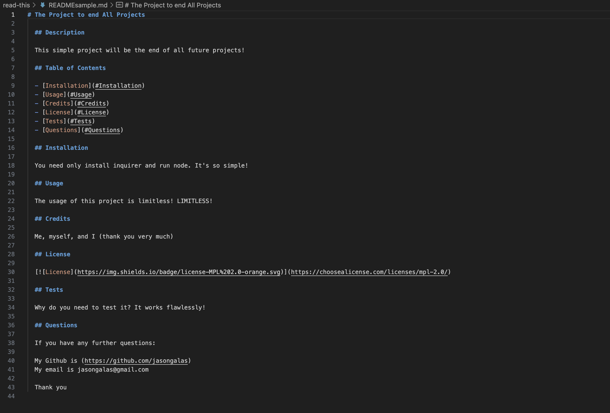

# read-this
Checking weather all over the world
## Description

The challenge for this module was to create a README generation by way of node js. This was the first time I've used node.js, which was a bit daunting at first.
Luckily it was a continuation of JavaScript, so that fear subsided. What came out of this was actually a pretty fun method to learn, and being able to use this in
other future projects is a neat prospect. I learned about installing and running packages in node, and learning to use my computer for JavaScript was fun.

## Installation

The link works in node js, and it requires an npm installation of inquirer@8.2.4. It requires fs as well, which is preinstalled in node js.

## Usage

When you open the index.js file in your terminal, run node index.js and the first prompt will appear. Fill out all of the prompts as they appear, choose your license, and all of this info will be relegated into a README.md file for you to use. (fyi the READMEsample.md is the example from the video capture.)

    ```md
    
    ```

## Credits

Drew's speedrun helped me double check my own work. Classmates helped point me in right direction when it came to license code. https://zoom.us/rec/play/J9mzcWphoYhkd8uXX9FNNQDcDpcwrwrD8sEd7nmw_wxOpf5dnkZnLFF6AQMc5gOzV_dLWrVYw6imPw5_.F-sUniq_XuOUcNjW?canPlayFromShare=true&from=share_recording_detail&startTime=1653271329000&componentName=rec-play&originRequestUrl=https%3A%2F%2Fzoom.us%2Frec%2Fshare%2Fd44wXaIKSft9ksSgsdJmPzjmIzObhT6eqZ-D8pWXQJRtxR2qKVjINf2xWRnzkeve.z9-aaxe6YnLfIJBo%3FstartTime%3D1653271329000 

## License

The standard MIT license was used for this module.

[](https://choosealicense.com/licenses/mit/) 

## Questions

If you have any further questions:

My Github is (https://github.com/jasongalas) 
My email is jasongalas@gmail.com

Thank you
